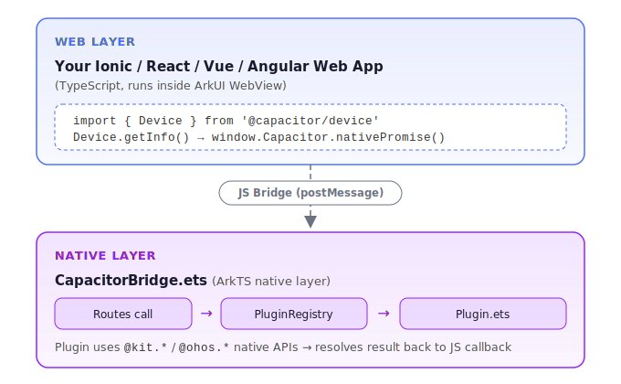

# Building an Oniro App with Capacitor OpenHarmony

This tutorial walks you through creating a web application that runs on Oniro/OpenHarmony devices using the Capacitor OpenHarmony platform adapter. You will start from a blank Ionic project, integrate the Oniro Capacitor packages, call native device APIs from JavaScript, and deploy the app to a real device or emulator.

## Table of Contents

1. [Introduction](#1-introduction)
2. [Prerequisites](#2-prerequisites)
3. [Create a New Ionic Project](#3-create-a-new-ionic-project)
4. [Install the OpenHarmony Platform Adapter](#4-install-the-openharmony-platform-adapter)
5. [Configure Capacitor](#5-configure-capacitor)
6. [Install Plugin Packages](#6-install-plugin-packages)
7. [Use Plugins in Your App](#7-use-plugins-in-your-app)
8. [Build the Web Assets](#8-build-the-web-assets)
9. [Add the OpenHarmony Platform](#9-add-the-openharmony-platform)
10. [Sync Assets and Plugins](#10-sync-assets-and-plugins)
11. [Configure App Signing](#11-configure-app-signing)
12. [Run the App](#12-run-the-app)
13. [View Logs](#13-view-logs)
14. [Troubleshooting](#14-troubleshooting)
15. [Next Steps](#15-next-steps)

## 1. Introduction

[Capacitor](https://capacitorjs.com/) is a cross-platform native runtime that lets you build web apps and deploy them to iOS, Android, and now **Oniro/OpenHarmony** — using a single JavaScript codebase.

The `@oniroproject/capacitor-openharmony` package is a Capacitor platform adapter for OpenHarmony. It provides:

- A **native container** built on the ArkUI `Web` component that loads your web app.
- A **JavaScript bridge** that connects `window.Capacitor` calls to native OpenHarmony APIs written in ArkTS.
- A **CLI integration** for the standard `npx cap add/sync/open` workflow.
- A set of **plugin packages** under the `@oniroproject` npm scope that mirror the standard Capacitor plugin API surface.

### How it works

<div style="text-align:center">

</div>

## 2. Prerequisites

Before you begin, ensure you have the following tools installed and configured.

| Tool | Version | Notes |
|------|---------|-------|
| Node.js | 20.x or 22.x LTS | Required by Capacitor CLI |
| npm | 10.x+ | Bundled with Node 20+ |
| Ionic CLI | 7.x | `npm install -g @ionic/cli` |
| OpenHarmony SDK | API 12+ | Install via DevEco Studio's SDK Manager, or using the Oniro IDE VS Code extension |
| hdc | Bundled with the SDK | Device connector CLI — needed for command-line builds and deploys |
| hvigorw | Bundled with Command Line Tools | Build tool for OpenHarmony — needed for command-line builds |
| DevEco Studio *or* Oniro IDE | Latest | For building, signing, and deploying. The Oniro IDE is a VS Code extension alternative to DevEco Studio |

### Install Node.js

```bash
# Using nvm (recommended)
nvm install 22
nvm use 22
node --version   # should print v22.x.x
```

## 3. Create a New Ionic Project

Use the Ionic CLI to scaffold a new Ionic React project with TypeScript.

```bash
npm install -g @ionic/cli
ionic start my-oniro-app blank --type=react --capacitor
cd my-oniro-app
```

The `--capacitor` flag sets up a `capacitor.config.ts` and installs Capacitor packages. The current Ionic CLI installs **Capacitor 8**. The `@oniroproject/capacitor-openharmony` adapter supports Capacitor 6, 7, and 8, so you can keep the version that was installed.

If you already have an existing Ionic/React/Vue/Angular project that uses Capacitor (6, 7, or 8), skip to [step 4](#4-install-the-openharmony-platform-adapter) and run the commands from that project's root.

## 4. Install the OpenHarmony Platform Adapter

Install the `@oniroproject/capacitor-openharmony` platform package:

```bash
npm install @oniroproject/capacitor-openharmony
```

This package registers itself as a Capacitor platform named `openharmony`. When using Capacitor CLI commands (`add`, `sync`, etc.), reference it by its full package name: `@oniroproject/capacitor-openharmony`.

## 5. Configure Capacitor

Open `capacitor.config.ts` (created by the Ionic scaffolding) and update the `appId` and `appName`. The scaffolded defaults (`io.ionic.starter`) need to be changed to your own values:

```typescript
import type { CapacitorConfig } from '@capacitor/cli';

const config: CapacitorConfig = {
  appId: 'com.example.myoniroapp',   // Reverse-domain bundle ID
  appName: 'MyOniroApp',             // Display name on the device
  webDir: 'dist'                     // Vite/React build output folder
};

export default config;
```

!!! warning "Important"
    The `appId` becomes the OpenHarmony bundle name. Use a reverse-domain format and avoid hyphens — OpenHarmony bundle IDs may only contain alphanumeric characters and dots.

## 6. Install Plugin Packages

The Oniro project provides OpenHarmony-native implementations of the most common Capacitor plugins. Each plugin has two parts:

- **`@capacitor/<name>`** — the standard Capacitor package, which provides the TypeScript interface and types used in your web code.
- **`@oniroproject/capacitor-<name>`** — the OpenHarmony native implementation (ArkTS `.ets` source files) that is copied into the native project during `cap sync`.

Install both layers together. Some `@capacitor/*` packages (like `@capacitor/app`) may already be installed by the Ionic scaffolding — that is fine, npm will skip them. The `@capacitor/*` packages will automatically resolve to a version compatible with the Capacitor core version you have installed:

```bash
npm install \
  @capacitor/app \
  @capacitor/browser \
  @capacitor/device \
  @capacitor/filesystem \
  @capacitor/network \
  @capacitor/preferences \
  @capacitor/toast \
  @oniroproject/capacitor-app \
  @oniroproject/capacitor-browser \
  @oniroproject/capacitor-device \
  @oniroproject/capacitor-filesystem \
  @oniroproject/capacitor-network \
  @oniroproject/capacitor-preferences \
  @oniroproject/capacitor-toast
```

!!! note "Why two packages?"
    Your web code imports from `@capacitor/device` etc. — these are the official Capacitor packages and ship the TypeScript API. The `@oniroproject/*` packages contain the `.ets` native code that `cap sync` copies into the `openharmony/` native project. Both must be installed as `dependencies`.

### Plugin overview

| Plugin | Package | What it does |
|--------|---------|-------------|
| App | `@oniroproject/capacitor-app` | App lifecycle events, `exitApp()` |
| Browser | `@oniroproject/capacitor-browser` | In-app browser (modal WebView), `open()` / `close()` |
| Device | `@oniroproject/capacitor-device` | Device model, OS version, language, memory info |
| Filesystem | `@oniroproject/capacitor-filesystem` | Read, write, append, delete files; directory listing |
| Network | `@oniroproject/capacitor-network` | Connection status and type; change events |
| Preferences | `@oniroproject/capacitor-preferences` | Key-value persistent storage |
| Toast | `@oniroproject/capacitor-toast` | Brief overlay notifications |

## 7. Use Plugins in Your App

Import plugins from the standard `@capacitor/*` packages — the same way you would for iOS or Android. The OpenHarmony bridge dispatches the calls to the `@oniroproject` native implementations at runtime.

### Device — read device information

```typescript
import { Device } from '@capacitor/device';

const info = await Device.getInfo();
console.log(info.model);        // e.g. "Huawei Mate 60"
console.log(info.osVersion);    // e.g. "4.0.0"
console.log(info.manufacturer); // e.g. "HUAWEI"

const lang = await Device.getLanguageCode();
console.log(lang.value);        // e.g. "zh"
```

### Network — check connectivity

```typescript
import { Network } from '@capacitor/network';

// One-time query
const status = await Network.getStatus();
console.log(status.connected);       // true / false
console.log(status.connectionType);  // "wifi" | "cellular" | "ethernet" | "none"

// Listen for changes
Network.addListener('networkStatusChange', (status) => {
  console.log('Network changed:', status.connectionType);
});
```

### Preferences — persistent key-value store

```typescript
import { Preferences } from '@capacitor/preferences';

// Write
await Preferences.set({ key: 'username', value: 'alice' });

// Read
const { value } = await Preferences.get({ key: 'username' });
console.log(value); // "alice"

// Delete
await Preferences.remove({ key: 'username' });
```

!!! note
    `@capacitor/preferences` must be installed alongside `@oniroproject/capacitor-preferences` (see [step 6](#6-install-plugin-packages)).

### Filesystem — read and write files

```typescript
import { Filesystem, Directory, Encoding } from '@capacitor/filesystem';

// Write a text file to the app data directory
await Filesystem.writeFile({
  path: 'notes/hello.txt',
  data: 'Hello from Oniro!',
  directory: Directory.Data,
  encoding: Encoding.UTF8,
});

// Read it back
const result = await Filesystem.readFile({
  path: 'notes/hello.txt',
  directory: Directory.Data,
  encoding: Encoding.UTF8,
});
console.log(result.data); // "Hello from Oniro!"

// Save a file to the user's Documents folder (triggers the system file picker)
await Filesystem.writeFile({
  path: 'export.txt',
  data: 'Exported content',
  directory: Directory.Documents,
  encoding: Encoding.UTF8,
});
```

!!! tip
    Writing to `Directory.Documents` on OpenHarmony triggers the system `DocumentViewPicker`, allowing the user to choose where to save the file.

### Toast — display brief messages

```typescript
import { Toast } from '@capacitor/toast';

await Toast.show({
  text: 'Saved successfully!',
  duration: 'short', // 'short' (2 s) or 'long' (3.5 s)
});
```

### Browser — open a URL in a modal browser

```typescript
import { Browser } from '@capacitor/browser';

await Browser.open({ url: 'https://oniroproject.org/' });

// Listen for events
Browser.addListener('browserPageLoaded', () => {
  console.log('Page loaded');
});

// Close programmatically
await Browser.close();
```

### App — lifecycle and exit

```typescript
import { App } from '@capacitor/app';

App.addListener('appStateChange', ({ isActive }) => {
  console.log('App is active?', isActive);
});

// Exit the application
App.exitApp();
```

## 8. Build the Web Assets

Before syncing to the native project, build your web application:

```bash
npm run build
```

This compiles TypeScript and bundles your app into the `dist/` directory (or whatever `webDir` is set to in `capacitor.config.ts`). The native WebView will serve files from this directory.

!!! note
    Run this command every time you change your web code before re-syncing.

## 9. Add the OpenHarmony Platform

Generate the native OpenHarmony project inside your Ionic project:

```bash
npx cap add @oniroproject/capacitor-openharmony
```

!!! note
    You must use the full npm package name `@oniroproject/capacitor-openharmony` — not just `openharmony`. The Capacitor CLI resolves third-party platforms by their package name.

This creates an `openharmony/` directory at the root of your project. It contains a complete OpenHarmony application project. The directory structure looks like:

```
openharmony/
├── AppScope/                     ← application-level config and resources
├── entry/
│   └── src/main/
│       ├── ets/
│       │   ├── capacitor/        ← Capacitor bridge (ArkTS)
│       │   │   ├── CapacitorBridge.ets
│       │   │   ├── PluginRegistry.ets  ← auto-generated by cap sync
│       │   │   └── plugins/            ← plugin .ets files (synced)
│       │   ├── entryability/
│       │   │   └── EntryAbility.ets
│       │   └── pages/
│       │       └── Index.ets
│       └── resources/
│           └── rawfile/
│               └── www/          ← your built web assets land here
├── build-profile.json5
├── hvigor/                       ← hvigor build config
├── hvigorfile.ts
└── oh-package.json5
```

!!! note
    Run `npx cap add` only once per project. For subsequent updates, use `cap sync`.

## 10. Sync Assets and Plugins

After every web build, sync your web assets and plugin native sources into the `openharmony/` native project:

```bash
npx cap sync @oniroproject/capacitor-openharmony
```

This command:

1. Copies the contents of `dist/` to `openharmony/entry/src/main/resources/rawfile/www/`.
2. Scans your `node_modules` for installed `@oniroproject/capacitor-*` plugins.
3. Copies each plugin's `.ets` source file into `openharmony/entry/src/main/ets/capacitor/plugins/`.
4. Regenerates `PluginRegistry.ets` with the correct imports and registrations for all detected plugins.

**Development workflow:**

```bash
# After changing web code:
npm run build && npx cap sync @oniroproject/capacitor-openharmony

# After installing a new @oniroproject plugin:
npm install @oniroproject/capacitor-<name>
npx cap sync @oniroproject/capacitor-openharmony
```

## 11. Configure App Signing

OpenHarmony applications must be signed before they can run on a physical device or a signed emulator. There are two options:

### Option A — Oniro IDE (VS Code extension)

1. Open the `openharmony/` folder in Visual Studio Code.
2. Ensure the **Oniro IDE** extension is installed from the VS Code Marketplace.
3. Use the extension to generate the signing configuration. It will automatically create the keys, profile, and update `build-profile.json5`.

### Option B — DevEco Studio

1. Open the `openharmony/` folder in DevEco Studio (File → Open).
2. Go to **File → Project Structure → Project → Signing Configs**.
3. Click **Automatically generate signature**.
4. Sign in with your Huawei ID if prompted.
5. DevEco Studio generates and stores a debug keystore and signing profile automatically.

!!! warning
    Without signing, `hdc install` will fail with a signature verification error.

## 12. Run the App

### Option A — Command line with hvigorw and hdc

#### Verify hdc and hvigorw are on your PATH

If you installed the SDK and Command Line Tools via DevEco Studio or the Oniro IDE, add them to your shell profile. Ensure the SDK's `toolchains/` directory (for `hdc`) and the Command Line Tools `bin/` directory (for `hvigorw`) are on your `PATH`.

```bash
hdc version
hvigorw --version
```

Verify that your device is connected:

```bash
hdc list targets
```

From the `openharmony/` directory inside your project:

```bash
cd openharmony

# 1. Build the debug HAP
hvigorw assembleHap --mode module -p product=default -p module=entry -p buildMode=debug --no-parallel --no-daemon

# 2. Install on the connected device
hdc install entry/build/default/outputs/default/entry-default-signed.hap

# 3. Launch the app
hdc shell aa start -a EntryAbility -b com.example.myoniroapp
```

!!! tip
    Replace `com.example.myoniroapp` with the `appId` you set in `capacitor.config.ts`.

### Option B — DevEco Studio

1. Open the `openharmony/` folder in DevEco Studio (**File → Open**, select the `openharmony` directory).
2. Connect your device via USB or start an emulator.
3. Click **Run** (the green play button) or press `Shift+F10`.
4. DevEco Studio builds the HAP, installs it on the device, and launches it automatically.

## 13. View Logs

JavaScript `console.log()` calls from your web app and Capacitor plugins are forwarded to the device log stream. Capacitor bridge messages use the `Capacitor` and `WebViewConsole` tags.

You can view the logs from your running app by finding its PID and filtering the `hilog` output:

```bash
# 1. Find your app's main process PID
hdc shell ps -ef | grep com.example.myoniroapp

# 2. Stream logs, filtering for Capacitor and web console output
hdc shell hilog -P <pid> | grep -E "Capacitor|WebViewConsole"
```

## 14. Troubleshooting

### `cap sync` does not copy a plugin

- Verify the `@oniroproject/capacitor-<name>` package is listed in `dependencies` (not `devDependencies`) of your `package.json`.
- Re-run `npm install` then `npx cap sync @oniroproject/capacitor-openharmony`.

### App starts but the screen is blank

- Check that `webDir` in `capacitor.config.ts` matches your build output folder (`dist` for Vite).
- Confirm `npm run build` completed without errors before running `cap sync`.
- Look for errors in the web console logs: `hdc shell hilog -P <pid> | grep -E "WebViewConsole"`.

### Changes not reflected after editing code

Always re-run the full cycle after any web code change:

```bash
npm run build && npx cap sync @oniroproject/capacitor-openharmony
```

Then rebuild and reinstall the application.

### `hdc install` fails with signature error

Ensure you have generated the signing configuration. The app must be signed before it can be installed on a device or emulator.

## 15. Next Steps

- **Explore the source** — the [Capacitor OpenHarmony repository](https://github.com/eclipse-oniro4openharmony/capacitor-openharmony) contains a complete Ionic React demo app and the full plugin source code.
- **Publish your own plugin** — follow the conventions in any existing plugin directory: one `.ets` file, `package.json` with `"capacitor": { "openharmony": { "src": "<PluginName>.ets" } }`, and a class named `<PluginName>Plugin` extending `CapacitorPlugin`.
