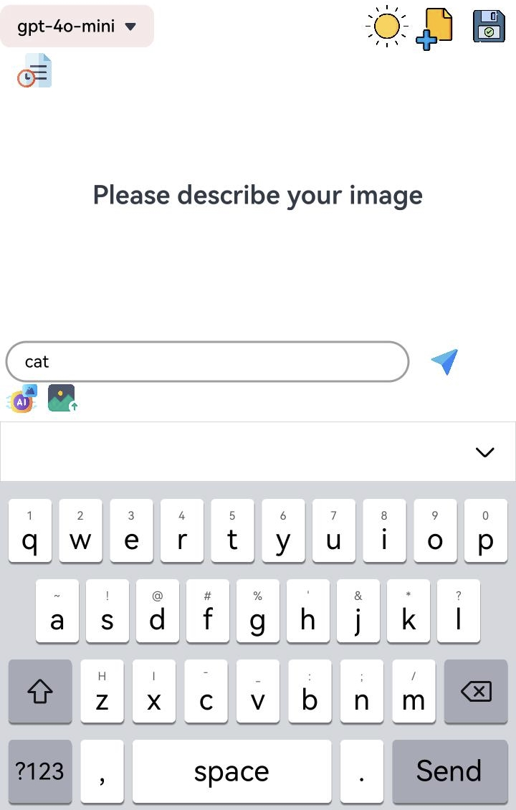
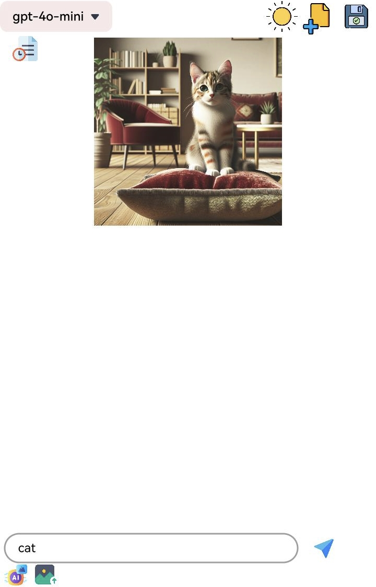
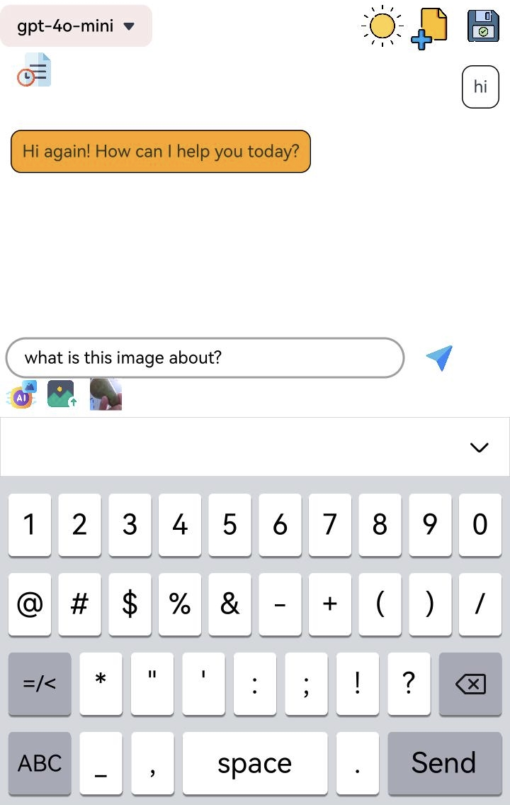
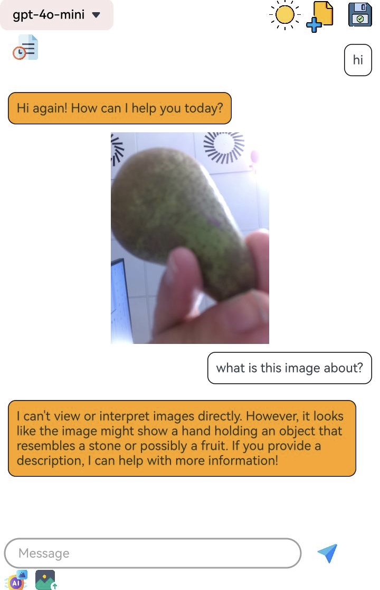
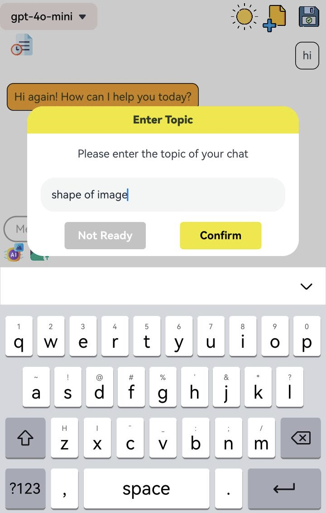
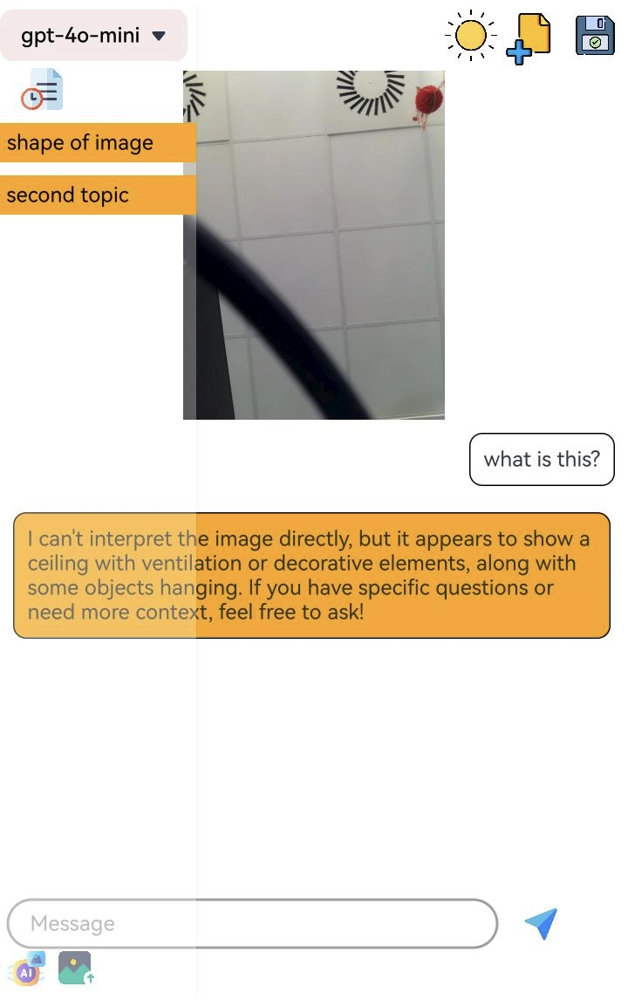
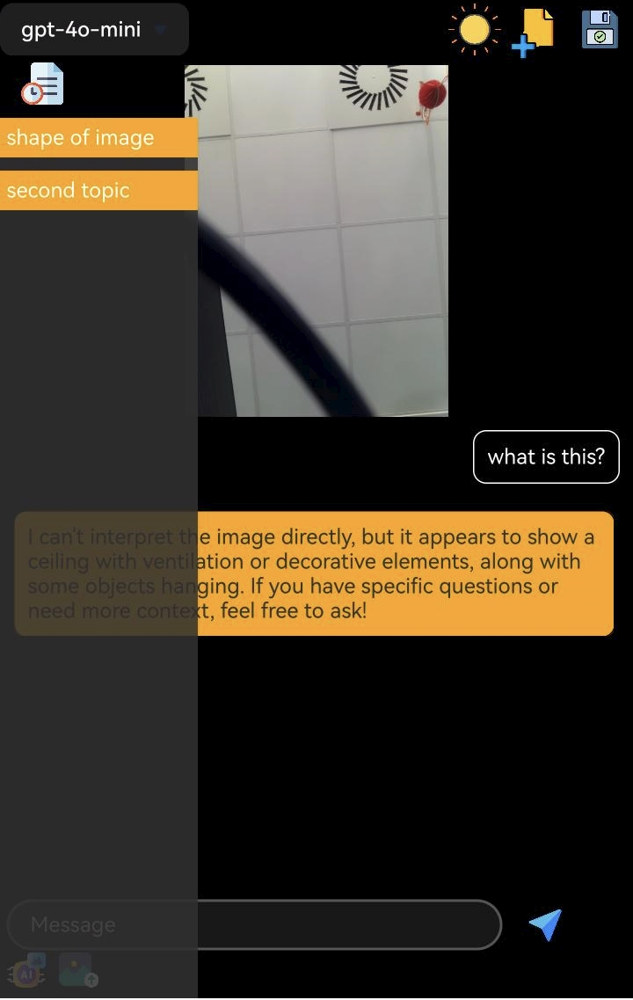

### OniroGPT 
A GPT client for the Oniro platform, enabling users to interact with large language models within the Oniro ecosystem.

#### Repository address
You can find the repository under this [link](https://github.com/eclipse-oniro4openharmony/app-oniroGPT) 

#### Software requirements
- **DevEco Studio version**: DevEco Studio 5.1.0 Release or higher version
- **OpenHarmony SDK version**: API version 18

#### Hardware requirements
- **Development board type**: Dayu Development Kit
- **OpenHarmony system**: 5.1.0 Release or higher version

#### Screenshots

    
    
    
    
    
    
    
    

