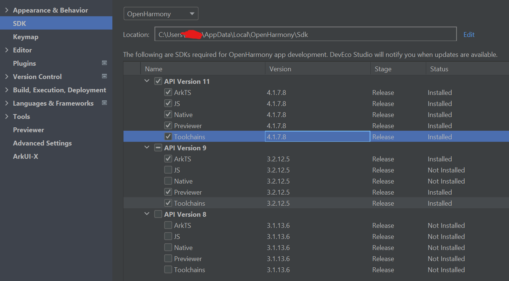
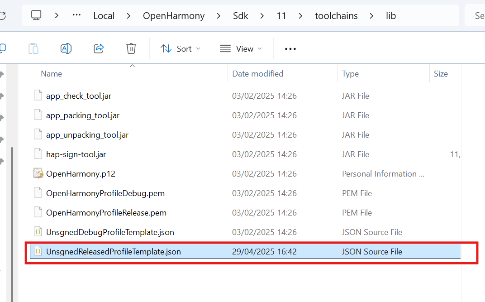

## install failed due to grant request permissions failed
We need to change application permission level
Solution:
1. Open the directory where the OpenHarmony SDK is located (you can view it by clicking Tools > SDK Manager > OpenHarmony SDK in the DevEco Studio menu bar).


2. Navigate to the Toolchains > {Version} > lib folder under the SDK directory, and open the `UnsignedReleasedProfileTemplate.json` file.


3. Change the parameter in `bundle-info` as following:

```typescript
    "bundle-info":{
    ...
        "apl":"system_core",
        "app-feature":"hos_system_app"
    },
```
!!! note
    If switching the system permissions does not work, try regenerating the automatic signature files.
