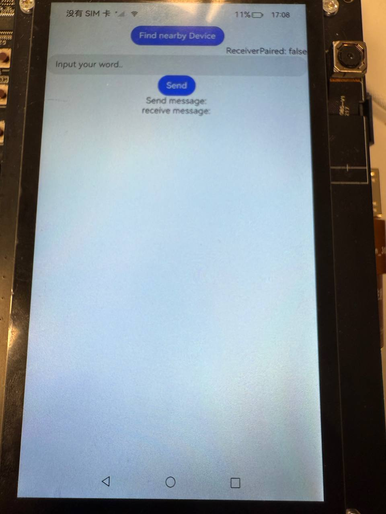

### Super Device Demo
Cross-device sync demo using OpenHarmony distributed KV store.

#### Repository address
You can find the repository under this [link](https://github.com/eclipse-oniro4openharmony/app-SuperDeviceDemo)  
 

#### Software requirements
- **DevEco Studio version**: DevEco Studio 4.1 Release or higher version
- **OpenHarmony SDK version**: API version 11

#### Hardware requirements
- **Development board type**: Dayu Development Kit
- **OpenHarmony system**: 4.1 Release or higher version

#### Screenshots

    

