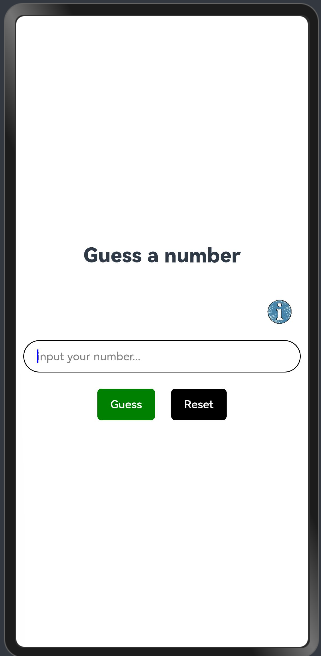
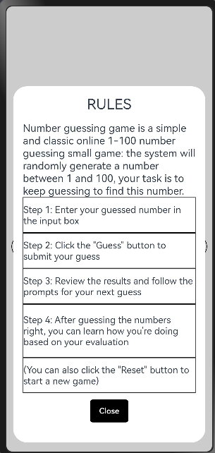
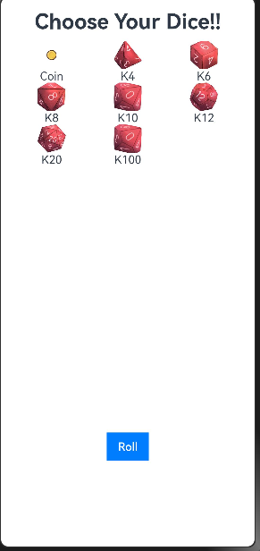
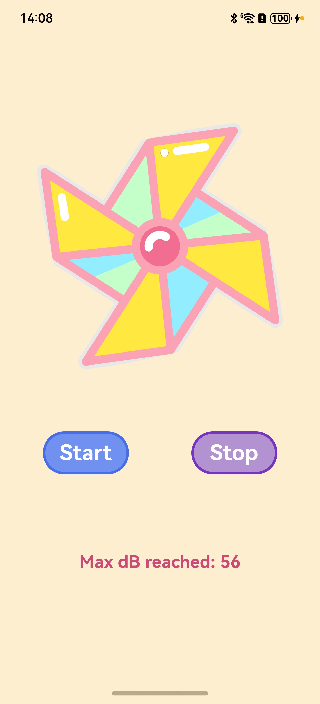

### Guess Number
An interactive number guessing game application

#### Repository address
You can find the repository under this [link](https://github.com/eclipse-oniro4openharmony/app-GuessNumber)   

#### Software requirements
- **DevEco Studio version**: DevEco Studio 5.1.0 Release or higher version
- **OpenHarmony SDK version**: API version 18

#### Hardware requirements
- **Development board type**: Dayu Development Kit
- **OpenHarmony system**: 5.1.0 Release or higher version

#### Screenshots

    
    

### Throw The Dice
Throw the dice is a simple example of helper app for RPG / boardgames

#### Repository address
You can find the repository under this [link](https://github.com/eclipse-oniro4openharmony/app-ThrowTheDice)  

#### Software requirements
- **DevEco Studio version**: DevEco Studio 5.1.0 Release or higher version
- **OpenHarmony SDK version**: API version 18

#### Hardware requirements
- **Development board type**: Dayu Development Kit
- **OpenHarmony system**: 5.1.0 Release or higher version

#### Screenshots

    

### Pinwheel 
A fun and interactive application that simulates a pinwheel spinning based on your breath!

#### Repository address
You can find the repository under this [link](https://github.com/eclipse-oniro4openharmony/app-Pinwheel)  

#### Software requirements
- **DevEco Studio version**: DevEco Studio 5.1.0 Release or higher version
- **OpenHarmony SDK version**: API version 18

#### Hardware requirements
- **Development board type**: Dayu Development Kit
- **OpenHarmony system**: 5.1.0 Release or higher version

#### Screenshots

    

