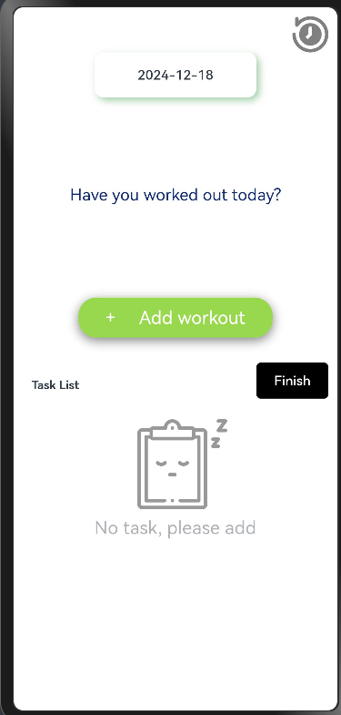
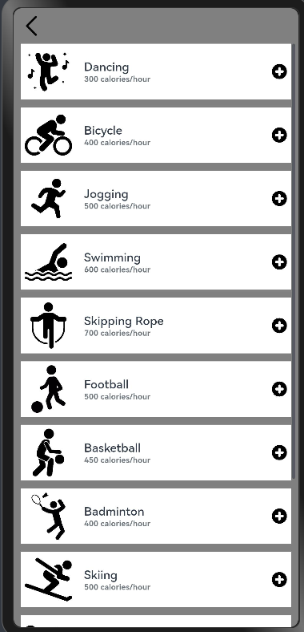
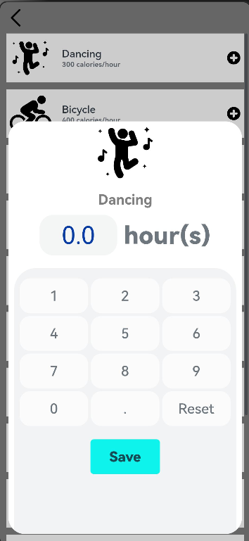
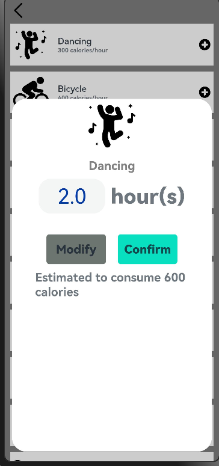
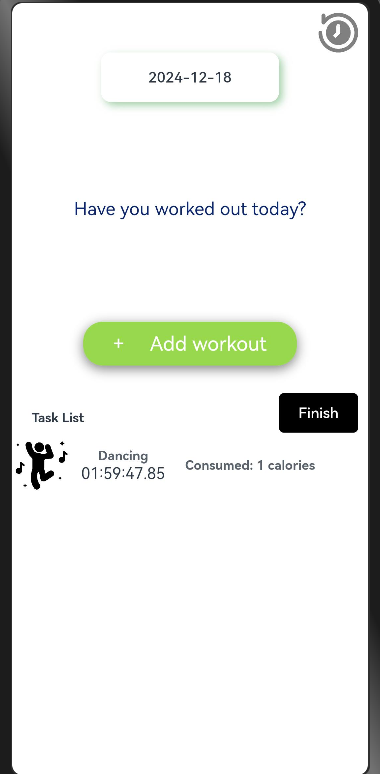
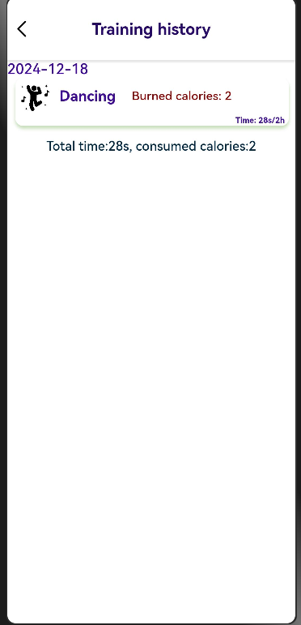
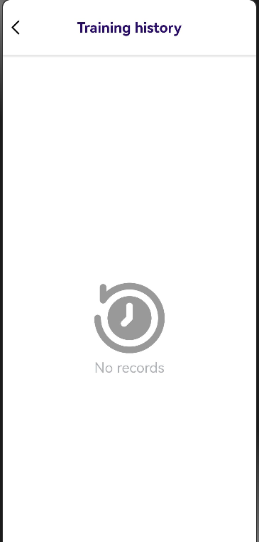
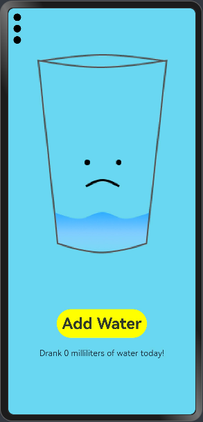

### [Workout Logbook](https://github.com/eclipse-oniro4openharmony/app-WorkoutLogbook)  
#### Software requirements
- **DevEco Studio version**: DevEco Studio 5.1.0 Release or higher version
- **OpenHarmony SDK version**: API version 18

#### Hardware requirements
- **Development board type**: Dayu Development Kit
- **OpenHarmony system**: 5.1.0 Release or higher version

#### Screenshots

    
    
    
    
    
    
    
    

### [Water Tracker](https://github.com/eclipse-oniro4openharmony/app-WaterTracker)  
#### Software requirements
- **DevEco Studio version**: DevEco Studio 5.1.0 Release or higher version
- **OpenHarmony SDK version**: API version 18

#### Hardware requirements
- **Development board type**: Dayu Development Kit
- **OpenHarmony system**: 5.1.0 Release or higher version

#### Screenshots

    

