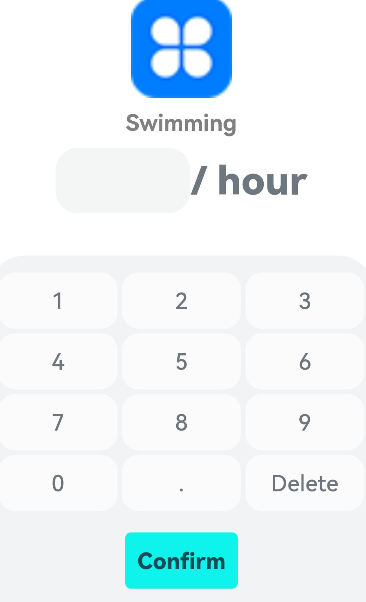

### Workout Logbook  
An intuitive app to track workouts, exercise duration, and calories for efficient health management.

#### Repository address
You can find the repository under this [link](https://github.com/eclipse-oniro4openharmony/app-WorkoutLogbook)  

#### Software requirements
- **DevEco Studio version**: DevEco Studio 5.1.0 Release or higher version
- **OpenHarmony SDK version**: API version 18

#### Hardware requirements
- **Development board type**: Dayu Development Kit
- **OpenHarmony system**: 5.1.0 Release or higher version

#### Screenshots

    
    
    
    
    
    
    
    

### Water Tracker  
App that tracks your water intake, allowing the user to follow their hydration levels.

#### Repository address
You can find the repository under this [link](https://github.com/eclipse-oniro4openharmony/app-WaterTracker)  

#### Software requirements
- **DevEco Studio version**: DevEco Studio 5.1.0 Release or higher version
- **OpenHarmony SDK version**: API version 18

#### Hardware requirements
- **Development board type**: Dayu Development Kit
- **OpenHarmony system**: 5.1.0 Release or higher version

#### Screenshots

    

