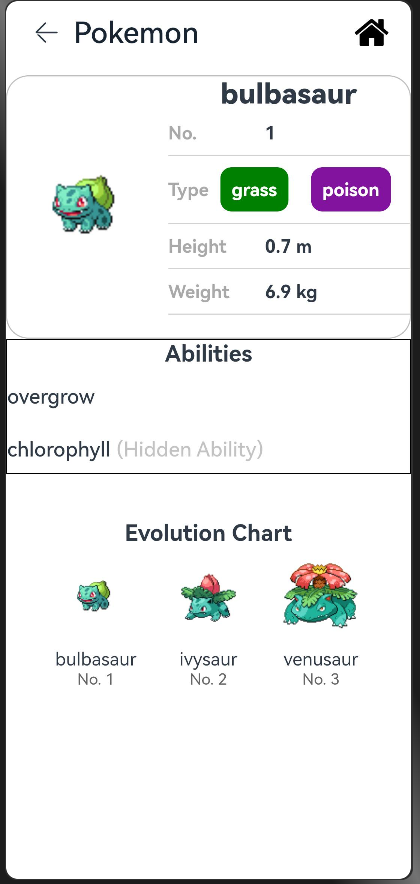

### PlayScout  
An App to explore and download free games.

#### Repository address
You can find the repository under this [link](https://github.com/eclipse-oniro4openharmony/app-PlayScout)  

#### Software requirements
- **DevEco Studio version**: DevEco Studio 5.1.0 Release or higher version
- **OpenHarmony SDK version**: API version 18

#### Hardware requirements
- **Development board type**: Dayu Development Kit
- **OpenHarmony system**: 5.1.0 Release or higher version

#### Screenshots

    
    
    
    

### Pokemon List  
Pokemon List: A application to explore Pokémon types, attributes, and skill effects with ease.

#### Repository address
You can find the repository under this [link](https://github.com/eclipse-oniro4openharmony/app-PokemonList)  

#### Software requirements
- **DevEco Studio version**: DevEco Studio 5.1.0 Release or higher version
- **OpenHarmony SDK version**: API version 18

#### Hardware requirements
- **Development board type**: Dayu Development Kit
- **OpenHarmony system**: 5.1.0 Release or higher version

#### Screenshots

    
    
    
    

### OniroNews  
A personalized news app where users can browse and collect their favorite news content.

#### Repository address
You can find the repository under this [link](https://github.com/eclipse-oniro4openharmony/app-OniroNews)  

#### Software requirements
- **DevEco Studio version**: DevEco Studio 5.1.0 Release or higher version
- **OpenHarmony SDK version**: API version 18

#### Hardware requirements
- **Development board type**: Dayu Development Kit
- **OpenHarmony system**: 5.1.0 Release or higher version

#### Screenshots

    
    
    
    
    
    
    

