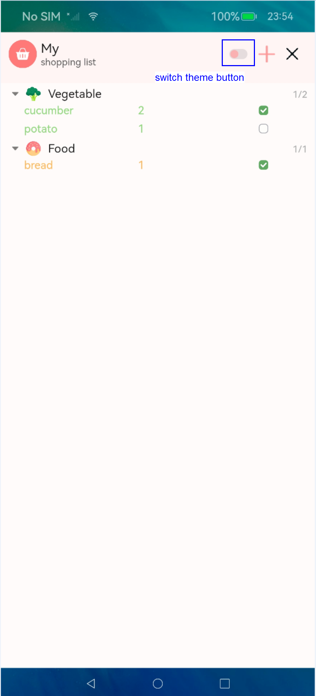

### Time Around World  
Time Around The World shows the time of different timezone cities.

#### Repository address
You can find the repository under this [link](https://github.com/eclipse-oniro4openharmony/app-TimeAroundWorld)  

#### Software requirements
- **DevEco Studio version**: DevEco Studio 5.1.0 Release or higher version
- **OpenHarmony SDK version**: API version 18

#### Hardware requirements
- **Development board type**: Dayu Development Kit
- **OpenHarmony system**: 5.1.0 Release or higher version

#### Screenshots

    
    
    
    

### Super Bright Flashlight
Oniro flashlight application

#### Repository address
You can find the repository under this [link](https://github.com/eclipse-oniro4openharmony/app-SuperBrightFlashlight)  

#### Software requirements
- **DevEco Studio version**: DevEco Studio 5.1.0 Release or higher version
- **OpenHarmony SDK version**: API version 18

#### Hardware requirements
- **Development board type**: Dayu Development Kit
- **OpenHarmony system**: 5.1.0 Release or higher version

#### Screenshots

    
    
    

### Bmicalculator  
A straightforward application that calculates Body Mass Index (BMI) based on user-input height and weight. This tool provides instant BMI results along with corresponding weight status categories, making it a handy resource for health and fitness tracking.

#### Repository address
You can find the repository under this [link](https://github.com/eclipse-oniro4openharmony/app-bmicalculator)  

#### Software requirements
- **DevEco Studio version**: DevEco Studio 5.1.0 Release or higher version
- **OpenHarmony SDK version**: API version 18

#### Hardware requirements
- **Development board type**: Dayu Development Kit
- **OpenHarmony system**: 5.1.0 Release or higher version

#### Screenshots

    

### Quote Of The Day  
Get an inspirational quote with the push of a button

#### Repository address
You can find the repository under this [link](https://github.com/eclipse-oniro4openharmony/app-QuoteOfTheDay)  

#### Software requirements
- **DevEco Studio version**: DevEco Studio 4.1 Release or higher version
- **OpenHarmony SDK version**: API version 11

#### Hardware requirements
- **Development board type**: Dayu Development Kit
- **OpenHarmony system**: 4.1 Release or higher version

#### Screenshots

    

### Unit Converter  
A simple, user-friendly application designed to convert between various units of measurement. This tool supports a wide range of unit categories, including length, weight, volume, and temperature, providing quick and accurate conversions for everyday use.

#### Repository address
You can find the repository under this [link](https://github.com/eclipse-oniro4openharmony/app-unitconverter)  

#### Software requirements
- **DevEco Studio version**: DevEco Studio 5.1.0 Release or higher version
- **OpenHarmony SDK version**: API version 18

#### Hardware requirements
- **Development board type**: Dayu Development Kit
- **OpenHarmony system**: 5.1.0 Release or higher version

#### Screenshots

    

### MyList  
An application to help you quickly organize and track items to buy or bring, so you never forget anything.

#### Repository address
You can find the repository under this [link](https://github.com/eclipse-oniro4openharmony/app-MyList)  

#### Software requirements
- **DevEco Studio version**: DevEco Studio 5.1.0 Release or higher version
- **OpenHarmony SDK version**: API version 18

#### Hardware requirements
- **Development board type**: Dayu Development Kit
- **OpenHarmony system**: 5.1.0 Release or higher version

#### Screenshots

    
    
    
    
    
    
    
    
    
    

