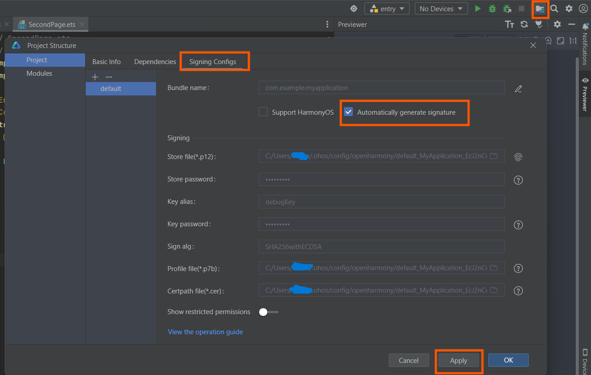

### Install HDC  

1. Find the [pipeline](https://github.com/eclipse-oniro-mirrors/docs/blob/OpenHarmony-5.1.0-Release/en/release-notes/OpenHarmony-v5.1.0-release.md) whose name is ohos-sdk-full or ohos-sdk-public, click **Download Link**, and select **Full Package**.  
   Use conditional filtering: select project `openharmony`, branch `OpenHarmony-5.1.0-Release`, and a date from the previous month or a manual range.  
   Then find **ohos-sdk-full_5.1.0-Release**, and download the full package (Windows/Linux).  
   *(If daily build SDK is not compatible with your DevEco Studio, try the rolling build SDK.)*
   {: .center}

2. In the `toolchain` folder, locate `hdc.exe` and `libusb_shared.dll`.
   {: .center}

3. Create a folder called `hdc_bin`, and copy `hdc.exe` and `libusb_shared.dll` into it.  
   {: .center}

4. Add the directory to the system `Path` environment variable:
   - Open `Settings` on Windows → search for `Edit the system environment variables`.
     {: .center}
   - In the `Advanced` tab, click `Environment Variables...`.
     {: .center}
   - Edit `Path` under `System variables`, click `New`, and paste your `hdc_bin` path.
     {: .center}
   - Open **Command Prompt** and run `hdc` to verify installation.
     {: .center}

---

### Run the Application on a Physical Device over USB

1. Connect a development board, such as the `HiHope HH-SCDAYU200`, running the OpenHarmony standard system to your computer.
   The device will appear at the top of DevEco Studio.  
   {: .center}

2. Generate a signature:
   - Click **Project Structure... → Project → Signing Configs** and select **Automatically generate signature**.
   - Click **Apply** and wait for DevEco Studio to generate the signature.
     {: .center}
   - You will find it in the `configuration` folder under `build-profile.json5`.  
     {: .center}

3. Click the `Run 'entry'` triangle button in the IDE.  
   {: .center}

4. Your application will now run on the development board.  
   {: .center width="50%"}

---

### Run the Application on a Watch

!!! note
    This tutorial uses a Huawei Watch 5.

1. Connect the watch and your computer to the same network.

2. Find the watch's IP address, then click **Tools → IP Connection** in the navigation bar.
!!! note
    To find the watch's IP address, first enable **Developer options**. Go to **Settings → HUAWEI WATCH 5**, find **Software Version**, and tap it five times.

   Enter the watch's IP address in the following field. After clicking the green **Start** button, the device appears at the top of DevEco Studio:
   {: .center}
   {: .center}

3. Generate a signature:
   - Click **Project Structure... → Project → Signing Configs** and select **Automatically generate signature**.
   - Click **Apply** and wait for DevEco Studio to generate the signature.
     {: .center}
   - You will find it in the `configuration` folder under `build-profile.json5`.  
     {: .center}

4. Click the **Run 'entry'** triangle button in the IDE.
   {: .center}

5. The application now runs on the watch.
   {: .center width="50%"}

---

You have now installed HDC and deployed your first application with DevEco Studio.

The following video provides a more detailed introduction to wearable development and practical sensor use.
<iframe
  width="100%"
  height="420"
  src="https://www.youtube-nocookie.com/embed/WITjqfofG6k?list=PLy7t4z5SYNaT3VUbRGCoNH471N9sSs0uV&index=2"
  title="HarmonyOS Wearable Tutorial"
  frameborder="0"
  loading="lazy"
  allow="accelerometer; autoplay; clipboard-write; encrypted-media; picture-in-picture; web-share"
  allowfullscreen>
</iframe>

