### Install HDC  

1. Find the [pipeline](https://ci.openharmony.cn/workbench/cicd/dailybuild/dailylist) whose name is ohos-sdk-full or ohos-sdk-public, click **Download Link**, and select **Full Package**.  
   Use conditional filtering: select project `openharmony`, branch `OpenHarmony-5.1.0-Release`, and a date from the previous month or a manual range.  
   Then find **ohos-sdk-full_5.1.0-Release**, and download the full package (Windows/Linux).  
   *(If daily build SDK is not compatible with your DevEco Studio, try the rolling build SDK.)*
   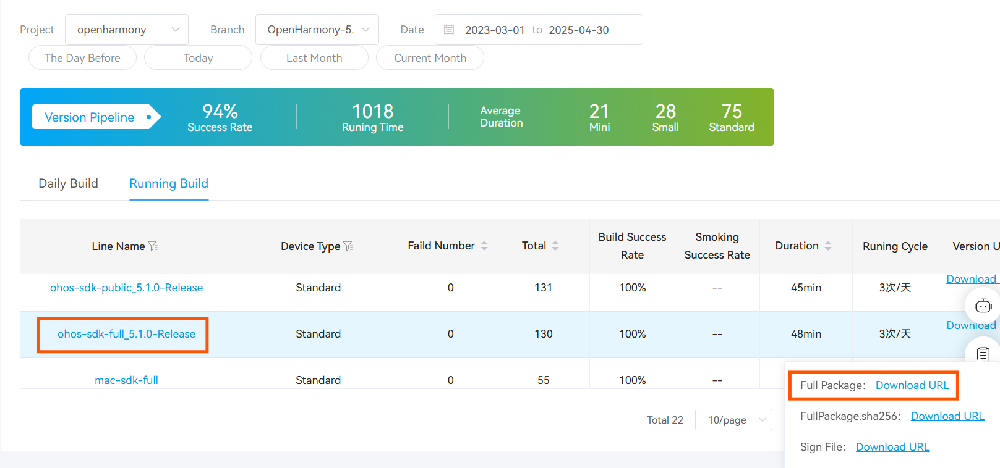{: .center}

2. Under the `toolchain` folder, locate `hdc.exe` and `libusb_shared.ddl`.  
   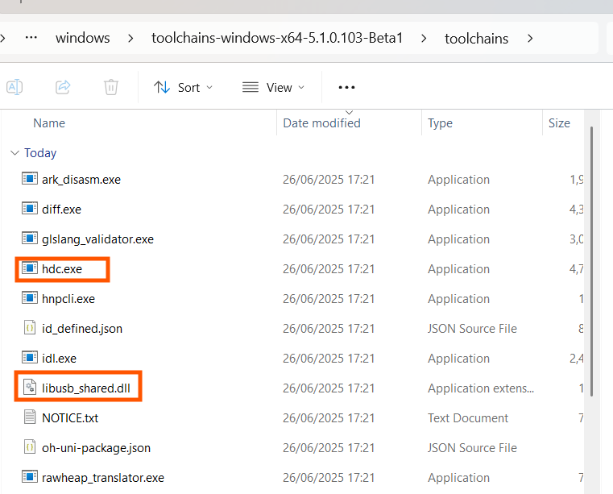{: .center}

3. Create a folder called `hdc_bin`, and copy `hdc.exe` and `libusb_shared.dll` into it.  
   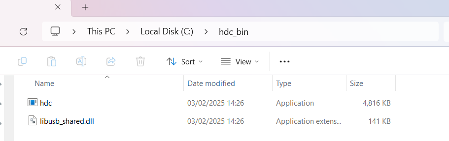{: .center}

4. Add **Environment Variable** to your system:
   - Open `Settings` on Windows → search for `Edit the system environment variables`.
     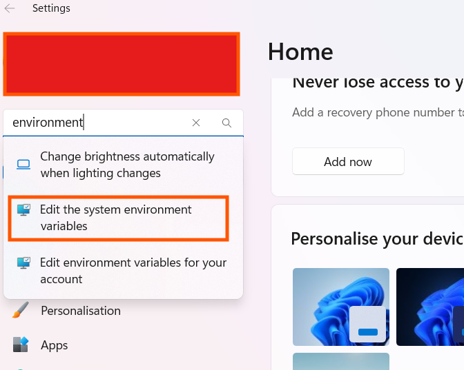{: .center}
   - In the `Advanced` tab, click `Environment Variables...`.
     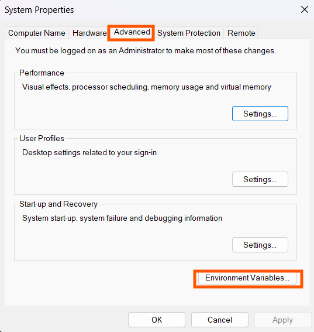{: .center}
   - Edit `Path` under `System variables`, click `New`, and paste your `hdc_bin` path.
     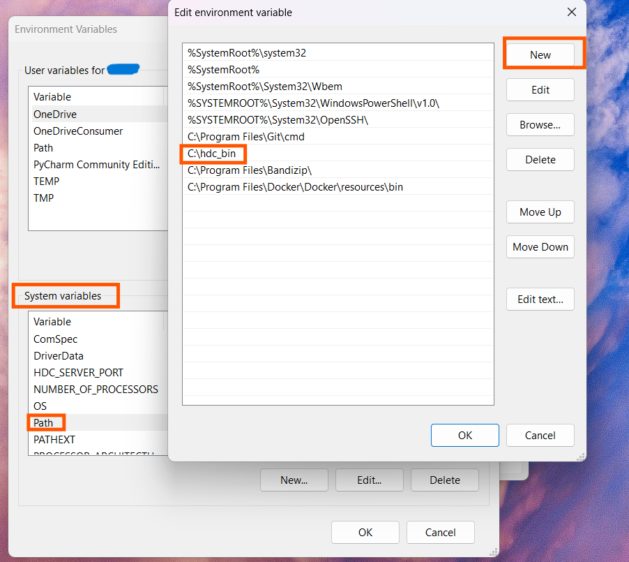{: .center}
   - Open **Command Prompt** and run `hdc` to verify installation.
     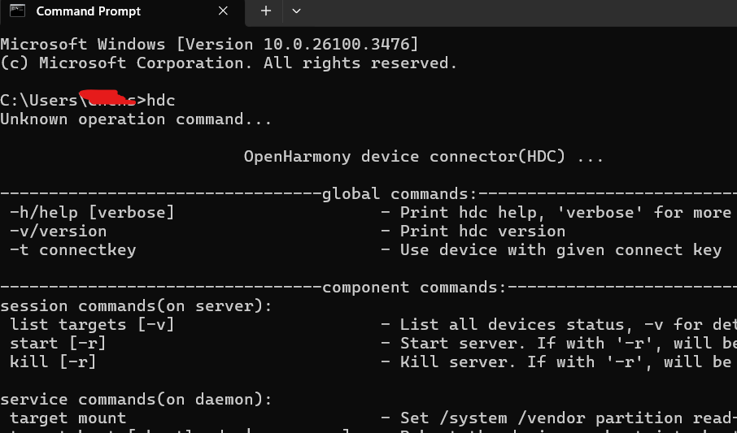{: .center}

---

### Use Real Machine to Run Application with USB  

1. Connect a development board (e.g., `HiHope HH-SCDAYU200`) running OpenHarmony standard system to your PC.  
   The device will appear at the top of DevEco Studio.  
   {: .center}

2. Generate signature:
   - Click `Project Structure...` → `Project > Signing Configs` → check `Automatically generate signature`.
   - Click `Apply` and wait until signature is generated.
     {: .center}
   - You will find it in the `configuration` folder under `build-profile.json5`.  
     {: .center}

3. Click the `Run 'entry'` triangle button in the IDE.  
   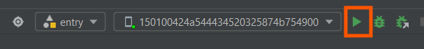{: .center}

4. Your application will now run on the development board.  
   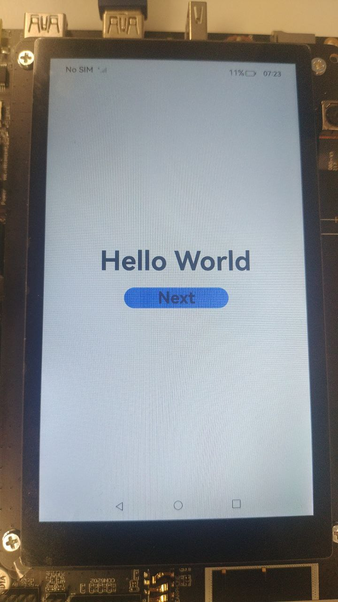{: .center width="50%"}

---

### Run the application on watch

!!! note
    We are using Huawei Watch 5 in this tutorial.

1. Make sure you watch connects the same network with your PC.

2. Check the IP address on your watch and click `Tools` → `IP Connection` on the navbar.
!!! note
    To find IP address on your watch, you need to enable `Developer Option` first. (Go to `Settings` → `HUAWEI WATCH 5`, find `Software Version` and continuously click 5 times)

   Put the watch IP address into the following field, you can find the device at the top of DevEco Studio after clicking the green `start` buttion:
   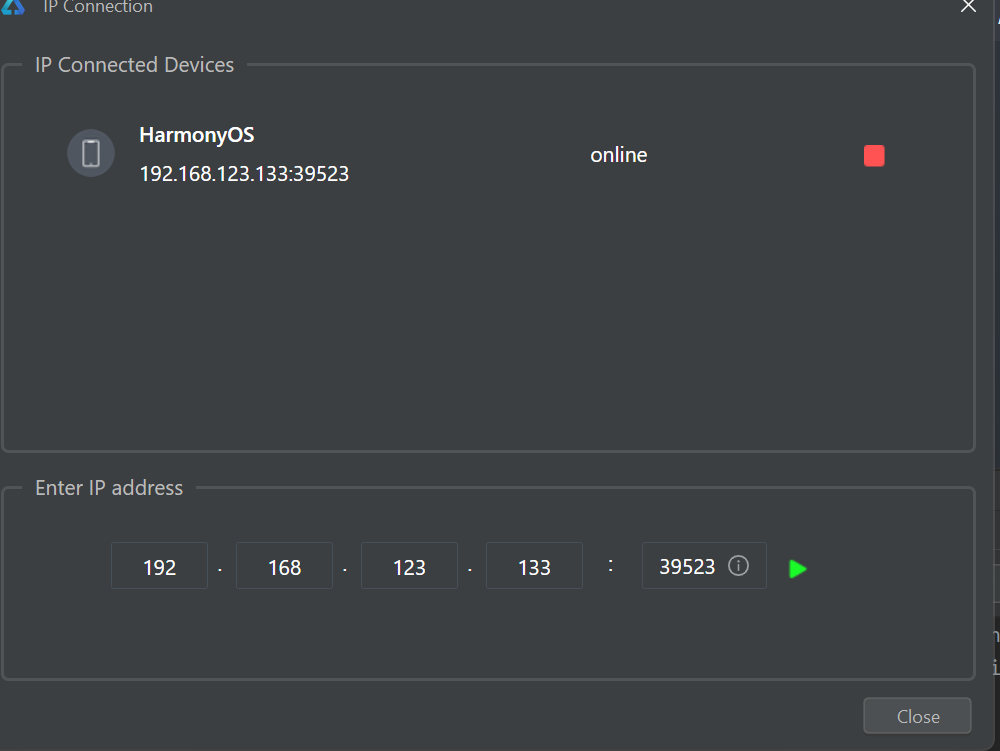{: .center}
   {: .center}

2. Generate signature:
   - Click `Project Structure...` → `Project > Signing Configs` → check `Automatically generate signature`.
   - Click `Apply` and wait until signature is generated.
     {: .center}
   - You will find it in the `configuration` folder under `build-profile.json5`.  
     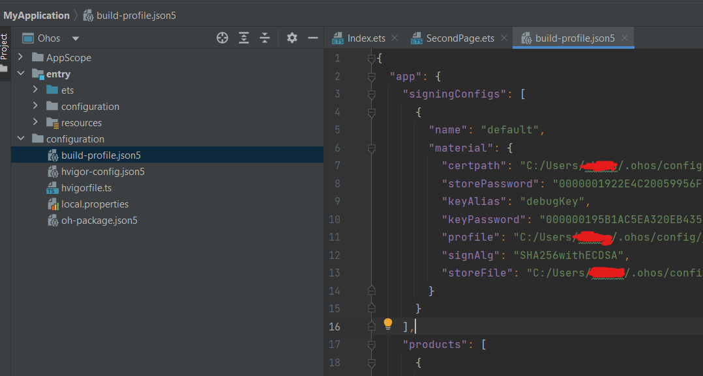{: .center}

3. Click the `Run 'entry'` triangle button in the IDE.  
   {: .center}

4. Your application will now run on the development board.  
   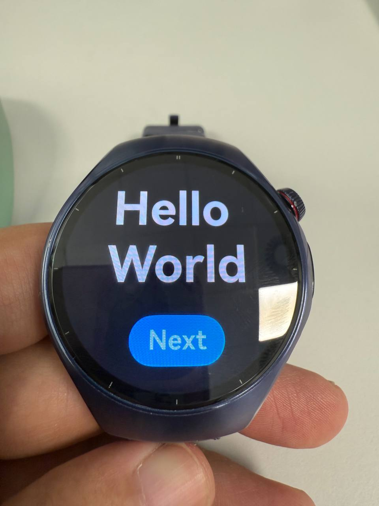{: .center width="50%"}

---

🎉 You’ve successfully installed HDC and deployed your first mobile application using DevEco Studio!

If you’re interested, this video takes you deeper into wearable development with practical sensor usage.
<iframe
  width="100%"
  height="420"
  src="https://www.youtube-nocookie.com/embed/watch?v=WITjqfofG6k&list=PLy7t4z5SYNaT3VUbRGCoNH471N9sSs0uV&index=2"
  title="HarmonyOS Wearable Tutorial"
  frameborder="0"
  loading="lazy"
  allow="accelerometer; autoplay; clipboard-write; encrypted-media; picture-in-picture; web-share"
  allowfullscreen>
</iframe>

