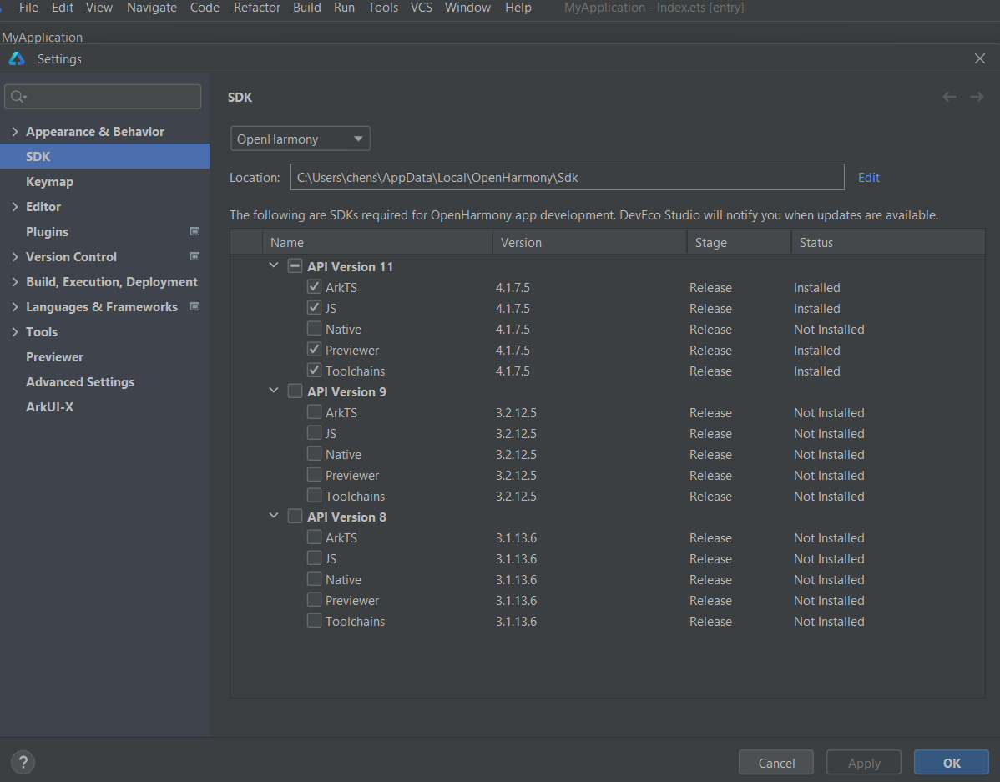

# Environment Configuration  
Run `DevEco Studio` for the first time, configuation setting pages will appear.  
  

Select `Do not import settings`  
  

On `Basic Setup` page, select install for **Node.js** and **Ohpm**.
  
Click **Next** to proceed to the SDK configuration page, and then set the SDK path to an appropriate location.
  
Accept the License Agreement
  
Check the summary information and go next
  
  
Environment configuration is finished.
  

!!! note "Install Revelant APIs"

    

      

      To run applications for OpenHarmony, you also need to install the relevant APIs.

      Open **DevEco Studio** and go to:  
      `Tool` → `SDK Manager` → `OpenHarmony`, select an API version and click **Apply** to download.

      > 💡 If you're using **DevEco Studio 5.1.0**, select **API Version 18** for development.

      

    

    {: .center}

  

    <table style="width:100%; table-layout:fixed; border-collapse:separate; border-spacing:0; border:1px solid #e6e6e6; border-radius:6px; overflow:hidden;">
      <thead style="background:#fafafa;">
        <tr>
          <th style="text-align:left;padding:12px 14px;white-space:normal;font-weight:600;border-right:1px solid #f0f0f0;">Version</th>
          <td style="text-align:center;padding:12px 10px;">4.0</td>
          <td style="text-align:center;padding:12px 10px;">4.1</td>
          <td style="text-align:center;padding:12px 10px;">5.0.0</td>
          <td style="text-align:center;padding:12px 10px;">5.0.1</td>
          <td style="text-align:center;padding:12px 10px;">5.0.2</td>
          <td style="text-align:center;padding:12px 10px;">5.0.3</td>
          <td style="text-align:center;padding:12px 10px;">5.1.0</td>
          <td style="text-align:center;padding:12px 10px;">5.1.1</td>
          <td style="text-align:center;padding:12px 10px;">6.0</td>
        </tr>
      </thead>
      <tbody>
        <tr>
          <th style="text-align:left;padding:12px 14px;white-space:normal;background:#fff;font-weight:600;border-right:1px solid #f0f0f0;">API Level</th>
          <td style="text-align:center;padding:12px 10px;">10</td>
          <td style="text-align:center;padding:12px 10px;">11</td>
          <td style="text-align:center;padding:12px 10px;">12</td>
          <td style="text-align:center;padding:12px 10px;">13</td>
          <td style="text-align:center;padding:12px 10px;">14</td>
          <td style="text-align:center;padding:12px 10px;">15</td>
          <td style="text-align:center;padding:12px 10px;">18</td>
          <td style="text-align:center;padding:12px 10px;">19</td>
          <td style="text-align:center;padding:12px 10px;">20</td>
        </tr>
      </tbody>
    </table>
  

