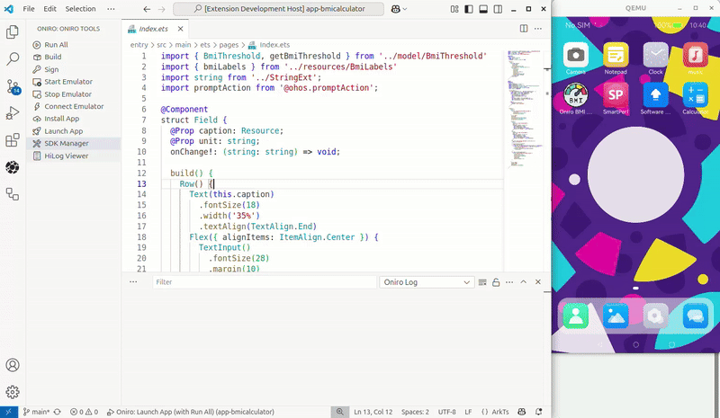

# Setting Up Oniro IDE for Application Development

The Oniro IDE is an essential part of the recommended development environment for Oniro/OpenHarmony application development. Provided as a Visual Studio Code extension, it streamlines the workflow for building, signing, deploying, running, and debugging Oniro apps, as well as managing SDKs and emulators. Oniro IDE serves as an alternative to Dev Eco Studio, offering a lightweight and flexible solution for developers who prefer working within VS Code.

> **Repository:** [eclipse-oniro4openharmony/oniro-vscode-ext](https://github.com/eclipse-oniro4openharmony/oniro-vscode-ext)



## Why Use Oniro IDE?

Oniro IDE integrates Oniro/OpenHarmony development tools directly into VS Code, providing:

- A dedicated Oniro sidebar for all major development actions
- One-click build, sign, and deploy workflows
- Emulator management and device deployment
- Integrated log viewer and SDK manager
- Support for Oniro-specific build tasks and debugging

## Prerequisites

Before installing Oniro IDE, ensure your system has:

- **Node.js** (LTS recommended)
- **Java SDK** (required for building/signing apps)
- **QEMU** (required for running the Oniro emulator)

All dependencies must be available in your system `PATH`.

## Installing Oniro IDE

### From Marketplace / Open VSX

Install Oniro IDE from:

- [Visual Studio Code Marketplace](https://marketplace.visualstudio.com/items?itemName=francescopham.oniro-ide)
- [Open VSX Registry](https://open-vsx.org/extension/francescopham/oniro-ide)

Steps:

1. Open the Extensions view (`Ctrl+Shift+X`).
2. Search for "Oniro IDE".
3. Click **Install**.

### From Source (Development)

Clone and build the extension from the official repository:

```bash
git clone https://github.com/eclipse-oniro4openharmony/oniro-vscode-ext.git
cd oniro-ide
npm install
npm run compile
code .
# Press F5 in VS Code to launch the Extension Development Host
```

## Using Oniro IDE in Your Development Workflow

After installation, use the Oniro sidebar or Command Palette (`Ctrl+Shift+P`) to access Oniro commands. The typical workflow includes:

1. **SDK & Tools Setup**: Use the **SDK Manager** to install/update OpenHarmony SDKs, command-line tools, and the Oniro emulator.
2. **Signature Configs**: Generate signing configurations if your app does not have them.
3. **Build and Sign**: Use Oniro commands to build and sign your app.
4. **Emulator**: Start and connect to the Oniro emulator.
5. **Deploy**: Install and launch your `.hap` package on the emulator or device.
6. **Run All**: Use the "Run All" command for a full automated flow, including log streaming.
7. **HiLog Viewer**: View logs for your running app.

## Oniro IDE Commands

The extension provides the following commands:

- `oniro-ide.runAll`: Run all steps (emulator, build, install, launch, log viewer)
- `oniro-ide.build`: Build the Oniro app
- `oniro-ide.sign`: Sign the Oniro app
- `oniro-ide.startEmulator`: Start the Oniro emulator
- `oniro-ide.stopEmulator`: Stop the Oniro emulator
- `oniro-ide.connectEmulator`: Connect to the running emulator
- `oniro-ide.installApp`: Install the app on the emulator/device
- `oniro-ide.launchApp`: Launch the app on the emulator/device
- `oniro-ide.openSdkManager`: Open the Oniro SDK Manager
- `oniro-ide.showHilogViewer`: Open the Oniro HiLog log viewer

## Extension Settings

You can configure the following settings in VS Code:

- `oniro.sdkRootDir`: Root directory for OpenHarmony SDKs (default: `${userHome}/setup-ohos-sdk`)
- `oniro.cmdToolsPath`: Directory for OpenHarmony command-line tools (default: `${userHome}/command-line-tools`)
- `oniro.emulatorDir`: Directory for Oniro emulator (default: `${userHome}/oniro-emulator`)

## Platform Support & Issues

- Oniro IDE commands are developed and verified for Linux environments.
- Report issues and feature requests via the [GitHub repository](https://github.com/eclipse-oniro4openharmony/oniro-vscode-ext).

## Recommended `launch.json` for Oniro IDE

To enable the F5 shortcut for the Oniro "Run All" workflow, add the following to your `.vscode/launch.json`:

```json
{
    "version": "0.2.0",
    "configurations": [
        {
            "name": "Oniro: Launch App (with Run All)",
            "type": "oniro-debug",
            "request": "launch"
        }
    ]
}
```

This allows you to use F5 or the "Run" button in VS Code to trigger the Oniro "Run All" command for building, deploying, and launching your app.

## ArkTS Language Integration

For ArkTS language support, consider the [ArkTS VS Code plugin](https://github.com/Groupguanfang/arkTS) for source code navigation, completion, and linting.
