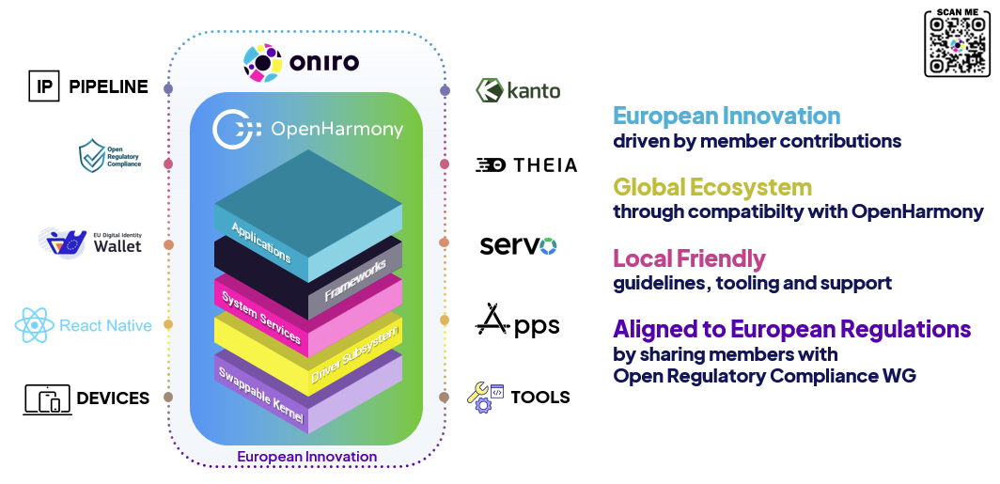

The Eclipse Oniro architecture builds on the solid foundations of OpenHarmony, enhancing and expanding its capabilities. All system enhancements are rigorously managed by an **advanced IP toolchain** to ensure compliance throughout the development process. Within this framework:

- **React Native** extends the usability of existing applications and ecosystems on top of OpenHarmony, enabling seamless integration across platforms.
- **Eclipse Kanto** expands Oniro's ecosystem adaptability and scalability by empowering edge devices with advanced IoT functionalities, including seamless cloud connectivity and flexible device management.
- The incorporation of the **Rust language**, particularly for the **Servo web engine**, bolsters the overall system's safety and security.
- **Eclipse Theia** enhances the development workflow, simplifying application creation within the ecosystem.

